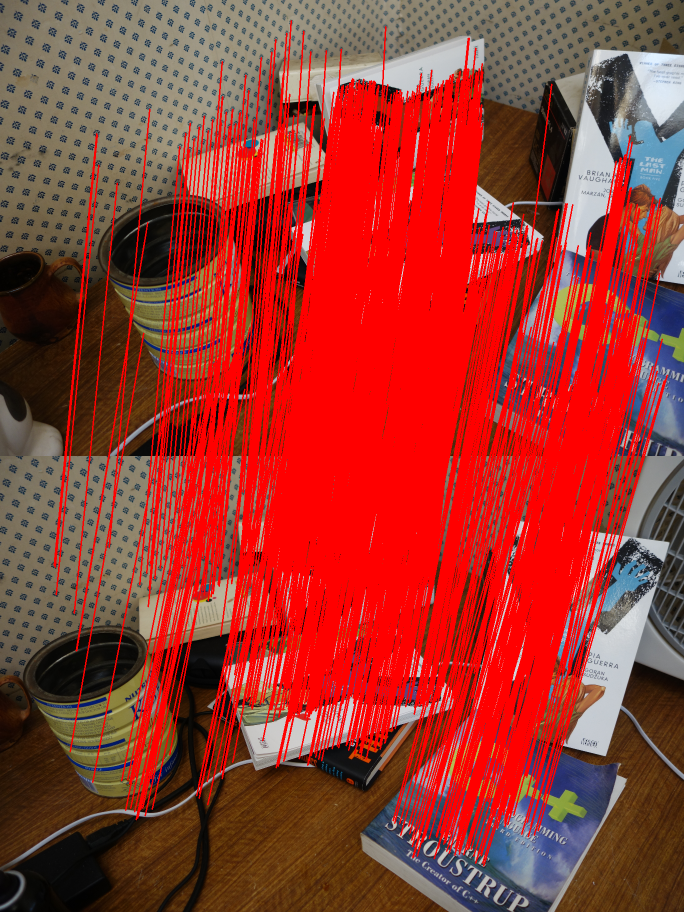
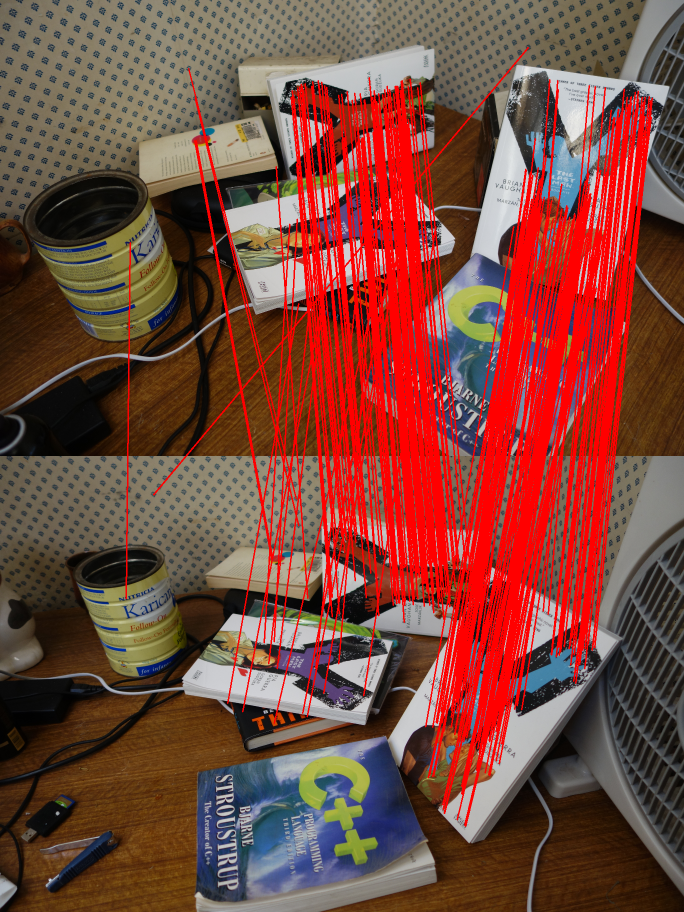
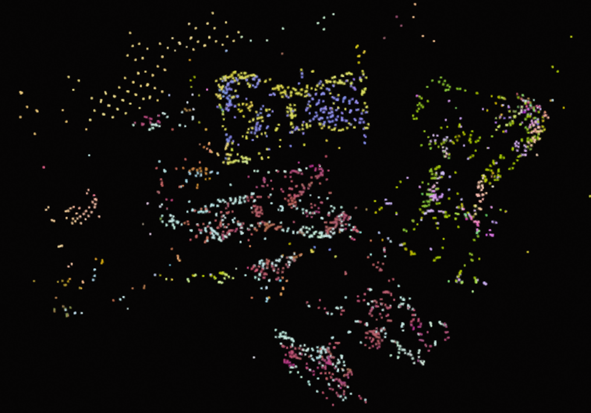
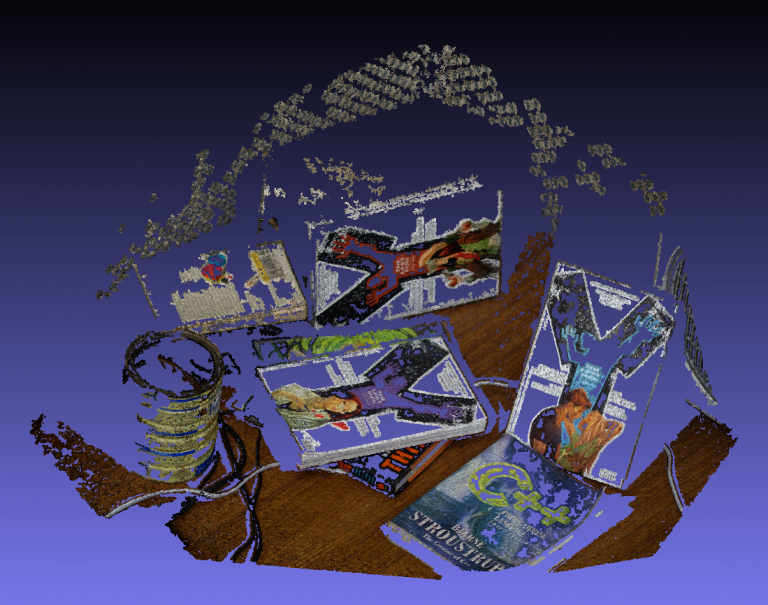

# SfM-3DReconstruction
## 3D reconstruction using Structure from Motion(SfM) algorithm.

Report: [Link](https://docs.google.com/document/d/12FPLzRIO8AhcV78BXjLcLoiL17x3lf_6GzaUwWQ54Pc/edit?usp=sharing)

## Requirments

Build [OpenCV](https://gist.github.com/Mahedi-61/804a663b449e4cdb31b5fea96bb9d561) and [PCL](https://pcl.readthedocs.io/projects/tutorials/en/master/) libraries from source.

## Installation

```bash
git clone https://github.com/aditya-jha13/SfM-3DReconstruction
```

## Build & Run

```bash
cd path/to/SfM-3DReconstruction
cmake .
make
./mySfM
```
## Demo

The input images are present in `test images` folder. The images are taken from different viewpoints of a scene.

### Feature Matching

The features are detected in each image using the `AKAZE Detector` and features are matched for each pair of image using `FLANN Based Matcher`.





### Final Reconstruction & Comparison

Final Image of Reconstruction(pointclouds)



Expected Reconstruction(3D triangular meshes)



The expected output is optimal as it has `bundle adjustment` integrated as well as the the point clouds are made denser by converting pointclouds to meshes.

`TODO`: Integrate bundle adjustment and make the final reconstruction denser.

## About

The first step in the SfM pipeline is `Feature Matching` where we find and match the features between each pair of images which is later used to find the relative transformation between the images. In the second step, we `estimate motion` between the images and `triangulate` the matched points in 3D space. The major functions used in this step are `cv::findEssentialMat`, `cv::recoverPose` and `cv::triangulatePoints`.
